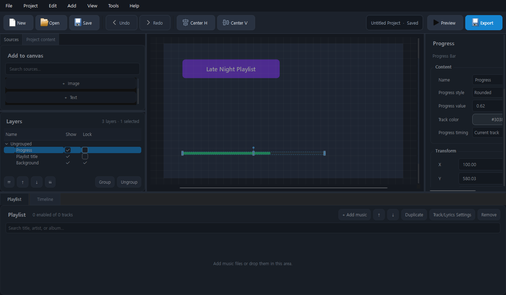

<div align="center">
  
  <h1>Playlist Canvas</h1>
  <p>음악, 가사, 비주얼 요소를 하나의 캔버스에서 편집해 플레이리스트 영상을 만드는 Windows 데스크톱 편집기</p>

  <p>
    
    
    
    
    
  </p>
</div>



## 소개

Playlist Canvas는 정적인 이미지와 음악을 합치는 수준을 넘어, 앨범 커버·가사·재생 진행률·오디오 비주얼라이저·파티클 등의 요소를 자유롭게 배치하고 MP4 영상으로 내보낼 수 있는 편집기입니다.

프로젝트는 미디어를 함께 포함할 수 있는 단일 `.pvsproj` 파일로 저장할 수 있어 다른 컴퓨터로 옮기거나 백업하기 쉽습니다.

## 제작 방식

**Playlist Canvas는 ChatGPT Codex만을 이용해 제작한 프로그램입니다.**

기능 설계와 요구사항을 바탕으로 한 소스코드 작성, UI 개선, 리팩터링, 오류 분석과 수정, 자동화 테스트, Windows 배포 빌드 점검 및 GitHub 문서화 전 과정을 ChatGPT Codex와의 대화를 통해 진행했습니다.

## 주요 기능

- 자유 배치 캔버스와 레이어 기반 편집
- 이미지, 텍스트, 도형, 배경, 로고, 워터마크 지원
- 앨범 커버, 현재 재생 정보, 트랙 목록과 재생 진행률 표시
- LRC, SRT, WebVTT 가사·자막 및 곡별 타이밍 조절
- 오디오 비주얼라이저, 파형, 레벨 미터와 파티클 효과
- 요소 시작·종료 애니메이션과 캔버스 미리보기
- 다중 선택, 그룹, 정렬, 복사·자르기·붙여넣기, 실행 취소·다시 실행
- 디자인 프리셋과 AI 프로젝트 빌더 프롬프트 생성
- 자동 저장, 비정상 종료 복구와 누락 미디어 재연결
- 한국어·영어 UI, 라이트·다크 테마와 부드러운 스크롤
- H.264/H.265 및 지원되는 GPU 인코더를 이용한 MP4 내보내기
- FFmpeg 자동 다운로드, SHA-256 검증, 설치 및 즉시 적용

## 사용자 설치

1. GitHub의 **Releases** 페이지에서 최신 Windows ZIP 파일을 받습니다.
2. ZIP 파일을 원하는 폴더에 완전히 압축 해제합니다.
3. `Playlist Canvas.exe`를 실행합니다.
4. **도구 → 설정 → FFmpeg → FFmpeg 자동 다운로드 및 설치**를 선택합니다.
5. 새 프로젝트를 만들고 음악과 화면 요소를 추가한 뒤 MP4로 내보냅니다.

> `Playlist Canvas.exe`만 `_internal` 폴더와 분리하면 Python 또는 Qt DLL을 불러올 수 없습니다. 배포 폴더 전체를 함께 보관하세요.

## FFmpeg 자동 설치

FFmpeg는 애플리케이션 배포본에 포함되지 않습니다. 설정 화면에서 자동 설치를 실행하면 다음 절차가 백그라운드에서 진행됩니다.

1. BtbN FFmpeg Windows 64비트 GPL 배포본 확인
2. 다운로드 진행률과 현재 작업 표시
3. 공식 체크섬을 이용한 SHA-256 검증
4. 압축 해제 후 `ffmpeg -version` 실행 검증
5. `%LOCALAPPDATA%\PlaylistCanvas\tools\ffmpeg`에 사용자별 설치
6. 설치된 실행 파일 경로를 자동 저장하고 즉시 적용

설치 중에는 진행 창이 애플리케이션 모달로 표시되어 다른 편집 작업을 수행할 수 없습니다.

## 지원 형식

| 분류 | 형식 |
| --- | --- |
| 오디오 | MP3, WAV, FLAC, AAC, M4A, OGG |
| 이미지 | JPG, JPEG, PNG, WebP, SVG |
| 가사·자막 | LRC, SRT, VTT |
| 프로젝트 | PVSProj, Project JSON |
| 영상 출력 | MP4 |

## 소스에서 실행

필요 환경은 Windows 64비트와 Python 3.12입니다.

```powershell
python -m venv .venv
.\.venv\Scripts\Activate.ps1
python -m pip install --upgrade pip
python -m pip install -r requirements-lock.txt
python main.py
```

## 테스트

```powershell
$env:QT_QPA_PLATFORM = "offscreen"
python -m compileall -q main.py app tests
python -m unittest discover -s tests -v
```

Windows GitHub Actions에서도 같은 컴파일, 회귀 테스트, PyInstaller 빌드와 패키지 스모크 테스트를 실행합니다.

## Windows 배포본 빌드

```powershell
python -m PyInstaller --noconfirm --clean playlist_canvas.spec
```

완성된 `dist\Playlist Canvas` 폴더 전체를 ZIP으로 묶어 GitHub Release에 첨부합니다. 자세한 배포 절차는 [PACKAGING.md](PACKAGING.md)를 참고하세요.

## 프로젝트 구조

```text
playlist_project/
├─ app/                    # 편집기 UI, 모델, 서비스와 렌더러
├─ app/resources/          # 애플리케이션 아이콘
├─ docs/images/            # README 이미지
├─ tests/                  # 회귀 및 배포 계약 테스트
├─ tools/                  # 개발 보조 도구
├─ main.py                 # 애플리케이션 진입점
├─ playlist_canvas.spec    # PyInstaller Windows 빌드 설정
└─ PACKAGING.md            # 배포 및 검수 가이드
```

## 로그 및 문제 해결

- 로그 폴더: `%LOCALAPPDATA%\PlaylistCanvas\logs`
- 앱이 실행되지 않으면 EXE와 `_internal` 폴더가 같은 배포 폴더에 있는지 확인합니다.
- GPU 인코더가 실패하면 설정에서 CPU H.264 (`libx264`)를 선택합니다.
- FFmpeg 다운로드가 실패하면 네트워크, 방화벽과 앱 로그를 확인합니다.
- 프로그램의 **도움말 → 프로그램 정보**에서 진단 정보를 복사할 수 있습니다.

## 라이선스 안내

FFmpeg 자동 설치 기능이 사용하는 BtbN FFmpeg GPL 배포본은 별도의 오픈 소스 라이선스를 따릅니다. 저장소를 공개하거나 바이너리를 배포하기 전에 Playlist Canvas 자체의 라이선스 파일과 제3자 고지 정책을 확정해 추가하세요.
