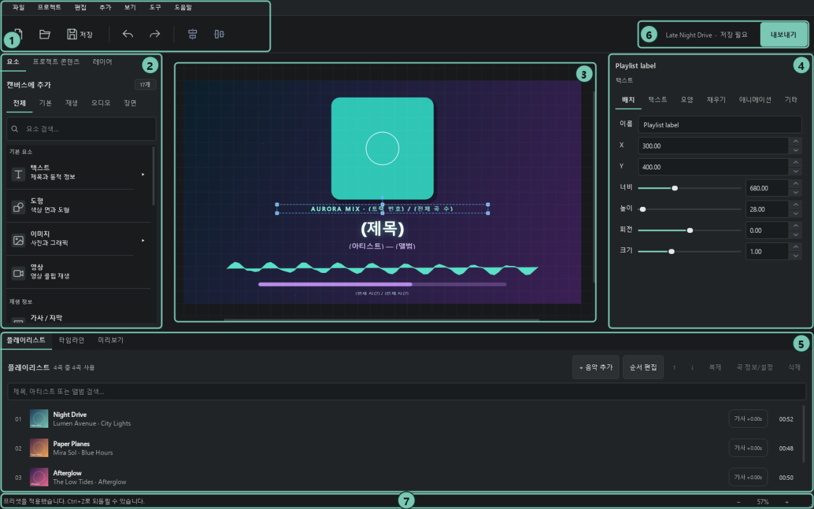
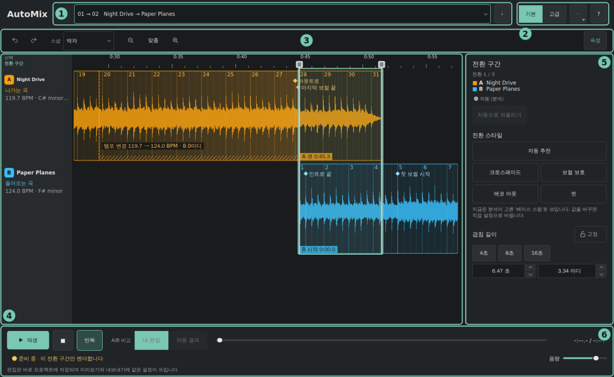

> **개발 안내:** 현재 Claude Code 구독료를 유지하기 어려워 신규 기능 개발은 잠시 중단됩니다. 다만 버그 수정, 기타 최적화, 치명적인 오류 대응 등 필요한 유지보수는 계속 진행됩니다.

<div align="center">
  
  <h1>Playlist Canvas</h1>
  <p>좋아하는 음악에 가사와 움직이는 화면을 더해, 나만의 플레이리스트 영상을 만드세요.</p>
  <p>
    
    
    
  </p>
  <p>
    <a href="https://github.com/tharu8813/Playlist-Canvas/releases/latest"><b>최신 버전 다운로드</b></a> ·
    <a href="docs/releases/1.3.1.0.md">1.3.1.0 업데이트 내용</a> ·
    <a href="https://github.com/tharu8813/Playlist-Canvas/issues">문제 신고·기능 제안</a>
  </p>
</div>



Playlist Canvas는 음악, 앨범 커버, 가사, 배경과 다양한 시각 효과를 배치해 **MP4 영상으로 완성하는 Windows 데스크톱 소프트웨어**입니다. 디자인 프리셋으로 시작해도 되고, 타임라인·레이어·전환 편집으로 세밀하게 제작해도 됩니다. 프로그래밍 지식이나 별도의 Python 설치는 필요하지 않습니다.

**이 프로젝트는 아이디어 구상부터 구현까지 전 과정을 바이브 코딩(Vibe Coding) 방식으로 제작했습니다. 이용된 모델은 ChatGPT 5.6 Sol(Codex), Claude Opus 5.5(Claude Code)입니다.**

예제 영상은 [이곳](https://www.youtube.com/watch?v=k2-e5Nhj7RY)에서 확인할 수 있습니다. (Playlist Canvas 1.3.0.0v AutoMix 기준)

## 지금 어떤 프로그램인가요?

초기의 “플레이리스트 영상 생성기”를 넘어, 현재 Playlist Canvas는 다음을 하나의 워크플로로 묶은 앱입니다.

- **비주얼 편집기**: 레이어 배치, 스타일/애니메이션, 음악 반응 효과, 타임라인 기반 편집
- **오디오·가사 도구**: 가사 타이밍 편집, 곡별 오디오/EQ 조정, 메타데이터 편집
- **AutoMix 엔진**: 박자·키·보컬·분위기 분석 기반 전환 추천 및 수동 정밀 보정
- **렌더링 파이프라인**: 미리보기부터 최종 MP4 내보내기까지 FFmpeg 기반 출력
- **제품 운영 기능**: 프로젝트 저장/복구, 로컬라이징, 도움말, 업데이트/무결성 검사

즉, 한 문장으로는 **“작은 NLE(영상 편집기) + 오디오 믹싱 툴 + 음악 분석 엔진을 합친 특화 데스크톱 앱”**에 가깝습니다.

## 다운로드와 설치

1. [최신 릴리즈 페이지](https://github.com/tharu8813/Playlist-Canvas/releases/latest)의 **Assets**에서 `Playlist.Canvas-1.3.1.0-setup.exe`를 내려받습니다. `Source code` 파일은 일반 사용자용 설치 파일이 아닙니다.
2. 설치 파일을 실행하고 언어·설치 위치·바로가기 옵션을 선택합니다.
3. 설치가 끝나면 시작 메뉴나 바탕 화면에서 **Playlist Canvas**를 실행합니다.
4. **도구 → 설정 → FFmpeg → FFmpeg 자동 다운로드 및 설치**를 실행합니다.

**Windows 64비트용**이며 Windows 11을 기준으로 제작되었습니다. 인터넷 연결은 프로그램·FFmpeg 다운로드와 업데이트 확인에 필요합니다. 필요한 파일을 설치한 뒤에는 PC에 있는 음악과 미디어로 오프라인 편집을 할 수 있습니다.

FFmpeg는 음악과 화면을 합쳐 영상으로 만드는 데 필요한 구성요소입니다. 프로그램에 기본 포함되지 않지만 위 메뉴에서 설치하면 경로가 자동으로 설정됩니다. 영상 내보내기, 믹스 미리보기, AutoMix와 EQ 미리듣기를 사용하기 전에 설치해 주세요.

기존 버전 사용자는 같은 설치 파일로 업데이트할 수 있습니다. Windows에서 실행 확인 안내가 나타나면 [공식 릴리즈 페이지](https://github.com/tharu8813/Playlist-Canvas/releases/latest)에서 받은 파일인지 확인하세요.

## 첫 영상 만들기

1. **새 프로젝트 만들기** — 프로젝트 이름, 화면 크기, 디자인 프리셋을 고릅니다. 가로형 영상이나 세로형 영상에 맞춰 시작할 수 있습니다.
2. **음악 넣기** — 음악 파일을 플레이리스트에 추가하고 원하는 순서로 배치합니다. M3U/M3U8 목록에 담긴 로컬 음악도 가져올 수 있습니다.
3. **화면 꾸미기** — 배경, 앨범 커버, 제목, 가사와 비주얼라이저를 추가합니다. 캔버스에서 위치와 크기를 조절하고 속성에서 색상·글꼴·효과를 바꿉니다.
4. **미리보기 확인하기** — 하단 **미리보기** 탭에서 음악과 화면을 함께 확인합니다. 가사 타이밍이나 곡 전환이 어색하면 편집 화면으로 돌아가 조절합니다.
5. **프로젝트 저장하기** — 나중에 이어서 편집할 수 있도록 `.pvsproj`로 저장합니다. 다른 PC로 옮길 때는 미디어를 포함해 저장하세요.
6. **MP4 내보내기** — **내보내기**(`Ctrl+E`)에서 저장 위치와 화질을 선택합니다. 완료 후 영상을 재생하거나 저장 폴더를 열 수 있습니다.

처음 실행하면 화면 안내가 표시됩니다. 사용 중 막히는 곳에서는 **F1**을 누르면 현재 창에 맞는 도움말이 열립니다.

## 원하는 분위기로 화면 꾸미기

- **디자인 프리셋** — 노래방, 플로우, 시네마 자막, 리릭 포스터, 네온 나이트, 파스텔 드림, 바이닐 등으로 시작해 취향에 맞게 수정할 수 있습니다.
- **자유로운 배치** — 이미지·영상·텍스트·도형·로고를 레이어로 쌓고, 여러 요소를 묶거나 정렬할 수 있습니다.
- **곡 정보 자동 표시** — 재생 중인 곡에 맞춰 앨범 커버, 제목, 트랙 목록과 진행 막대가 바뀝니다.
- **음악에 반응하는 효과** — 비주얼라이저, 파형, 레벨 미터와 파티클을 추가합니다. 텍스트와 현재 자막에도 음악 반응을 적용하고 반응 대역·강도·커지는 속도·감소 속도를 조절할 수 있습니다. 원형 비주얼라이저 안에 앨범 커버를 배치할 수도 있습니다.
- **글자와 모양 꾸미기** — 자간·줄 간격·그라데이션·그림자·글로우를 조절하고 원·별·하트 등 모양으로 요소를 표시합니다.
- **애니메이션** — 등장·퇴장 효과와 둥실 떠다니기·숨쉬기·회전 등의 반복 모션을 적용합니다.

영상 요소의 소리는 사용하지 않으며, 영상의 배경음악은 플레이리스트에서 구성합니다.

## 가사와 자막 넣기

LRC·SRT·VTT 파일을 불러오거나 **가사 편집기**에서 음악을 들으며 타이밍을 맞출 수 있습니다. 곡마다 가사가 조금 빠르거나 늦게 나오면 곡 정보의 가사 설정에서 시간을 보정하세요.

현재 부르는 줄의 크기와 색상, 정렬과 줄 간격을 조절할 수 있습니다. 줄이 바뀔 때는 강조와 흐림이 자연스럽게 넘어가고, 긴 줄은 영역에 맞춰 축소됩니다.

**자막 전환 설정**에서 이동 방향·순차 이동·이전/현재/다음 줄의 크기·불투명도·거리별 블러를 조절합니다. 카테고리별 고급 모드를 켠 값만 기본 속성보다 우선하며, 색상과 글꼴은 기본 속성 및 줄별 스타일에서 설정합니다. 인트로와 보컬이 없는 긴 간주에는 임시 표시 줄을 추가할 수 있습니다.

하단 **타임라인**에서는 곡과 요소를 블록으로 표시합니다. 블록을 끌어 시작 위치와 길이를 편집하고, 원하는 위치에서 미리보기를 시작할 수 있습니다. **곡 정보/설정**의 MP3 메타데이터 편집기에서 제목·아티스트·앨범 정보와 커버를 수정할 수 있습니다.

## 곡을 자연스럽게 연결하는 AutoMix

**프로젝트 → 프로젝트 설정 → 곡 전환 → AutoMix**를 선택하면 곡의 박자·보컬·분위기를 분석해 전환 위치와 방식을 자동으로 정합니다. 단순히 곡을 겹치고 싶다면 **크로스페이드**, 바로 다음 곡으로 넘기고 싶다면 전환 없음으로 설정하세요.

AutoMix는 아직 **베타 기능**입니다. 처음 분석할 때는 준비 시간이 필요하며, 음악에 따라 결과가 다를 수 있으니 최종 미리보기를 들어 보세요. 분석은 PC 안에서 진행되고 결과는 다음 작업에 재사용됩니다.

### 전환을 직접 다듬기

플레이리스트의 곡 사이 전환 표시를 누르거나 **도구 메뉴의 AutoMix 편집기**를 엽니다.



- 두 곡의 파형을 보면서 시작 지점과 겹치는 길이를 조절합니다.
- 박자·마디에 맞춰 이동하거나 템포 변화, EQ와 보컬 교대 타이밍을 세밀하게 다듬습니다.
- Echo Out, Tape Stop, Filter Sweep 등 전환 방식을 골라 다른 분위기를 만들 수 있습니다.
- 편집한 구간만 반복해서 듣고 **A/B 비교**로 자동 전환과 비교합니다.
- 마음에 드는 설정은 프리셋으로 저장하고 다른 전환에 적용합니다. 실행 취소와 자동 전환 복귀도 지원합니다.

미리듣기와 최종 내보내기는 전체 믹스의 음량 처리에 따라 차이가 날 수 있습니다. 최종 확인은 전체 미리보기에서도 해 주세요.

## 곡마다 음량과 음색 조절하기

**곡 정보/설정 → 오디오**에서 곡별 음량과 **5밴드 EQ**를 조절할 수 있습니다. 특정 곡만 너무 크거나 저음이 강할 때 사용해 보세요. 바뀐 소리를 미리 들어 보고 영상에 반영할 수 있습니다.

곡의 BPM·키와 분석 진행 상황은 **곡 정보/설정 → 분석**에서 확인할 수 있습니다.

## 저장·백업과 업데이트

**프로젝트 저장**은 편집 내용을 보관하고, **MP4 내보내기**는 완성된 영상을 만드는 기능입니다. 나중에 수정하려면 영상과 함께 프로젝트 파일도 보관하세요.

- `.pvsproj`에 미디어를 함께 포함해 저장하면 다른 컴퓨터로 옮기기 편합니다. 저장한 프로젝트는 파일 탐색기에서 더블클릭해 열 수 있습니다.
- 자동 저장과 비정상 종료 복구를 지원합니다. 원본 음악이나 이미지의 위치가 바뀌면 누락 미디어를 다시 연결할 수 있습니다.
- 새 버전은 프로그램 시작 시 안내합니다. 직접 확인하려면 **도움말 → 업데이트 확인**을 선택하세요.
- **도구 → 설정 → 유지 관리**에서 설치 파일 손상 확인과 최신 버전 재설치를 할 수 있습니다. 환경설정·캐시 초기화 기능도 제공하며 프로젝트·프리셋·언어팩·설치된 FFmpeg는 보존합니다.

[1.3.1.0 전체 패치노트 보기](docs/releases/1.3.1.0.md)

## 지원하는 파일

| 종류 | 형식 |
| --- | --- |
| 음악 | MP3, WAV, FLAC, AAC, M4A, OGG |
| 이미지 | JPG, JPEG, PNG, WebP, SVG |
| 화면에 넣는 영상 | MP4, MOV, MKV, WebM, AVI, M4V |
| 가사·자막 | LRC, SRT, VTT |
| 음악 목록 | M3U·M3U8 가져오기, M3U8 내보내기 |
| 프로젝트 | PVSProj, Project JSON |
| 완성 영상 | MP4 |

M3U/M3U8 가져오기는 PC에서 찾을 수 있는 음악 파일을 추가합니다. 웹 스트리밍 주소나 찾을 수 없는 파일은 건너뜁니다.

## 도움말과 문제 해결

**F1**로 여는 사용 설명서는 인터넷 없이 볼 수 있습니다. 창별 탭, 주제 태그, 전체 검색과 그림 안내를 제공합니다. 가사·AutoMix 편집기의 단축키 안내는 **Shift+F1**로 확인하세요.

| 이런 경우 | 이렇게 해 보세요 |
| --- | --- |
| 내보내기나 믹스 미리보기를 시작할 수 없어요 | 설정에서 FFmpeg 설치 상태를 확인하고 자동 설치를 실행하세요. |
| AutoMix 준비가 오래 걸려요 | 첫 분석에는 시간이 필요합니다. 하단 작업 진행 상태를 확인하고 최종 믹스 준비가 끝날 때까지 기다려 주세요. |
| 미리보기가 끊겨요 | 미리보기 화질을 낮추거나 화면 효과를 줄여 보세요. 미리보기 화질은 최종 영상 화질에 영향을 주지 않습니다. |
| GPU로 내보내기에 실패해요 | 내보내기 설정에서 CPU H.264 인코더로 바꿔 보세요. |
| 저장 공간이 부족해요 | 출력 드라이브와 임시 파일이 저장되는 드라이브에 여유 공간을 확보하세요. 긴 영상이나 효과가 많은 영상은 추가 공간이 필요할 수 있습니다. |
| 프로그램 파일이 손상된 것 같아요 | 설정의 유지 관리에서 무결성 검사·강제 재설치를 실행하세요. 앱이 열리지 않으면 공식 설치 파일로 다시 설치하세요. |
| 문제가 계속 발생해요 | **도움말 → 프로그램 정보**에서 진단 정보를 복사하고, 발생 상황과 함께 [문제 신고](https://github.com/tharu8813/Playlist-Canvas/issues)에 남겨 주세요. |

로그는 `%LOCALAPPDATA%\PlaylistCanvas\logs`에서 찾을 수 있습니다. 신고할 때는 프로그램 버전, 작업 단계와 오류 메시지를 함께 적어 주세요. 로그나 화면을 공유하기 전 개인 파일 경로 등 공개하고 싶지 않은 정보가 있는지 확인하세요.

기본 언어는 한국어·영어이며, **도구 → 설정 → 일반 → 외부 언어팩**에서 다른 번역 파일을 추가할 수 있습니다. 번역을 직접 만들고 싶다면 [언어팩 안내](docs/language-packs/README.md)를 참고하세요.

## 만든 영상을 공개하거나 수익화해도 되나요?

**네.** 프로그램으로 만든 영상과 콘텐츠는 개인·교육·업무·상업 목적으로 이용하고 판매·광고·후원 등으로 수익화할 수 있습니다. 사용하는 음악·이미지·영상의 권리는 별도로 확인해 주세요.

출처 표시는 권장하지만 **선택 사항이며 라이선스 의무가 아닙니다**. 영상 안에 워터마크를 넣을 의무도 없습니다. 원하시면 영상 설명에 다음 문구를 사용할 수 있습니다.

```text
이 영상은 Playlist Canvas를 이용해 제작되었습니다.
https://github.com/tharu8813/Playlist-Canvas
```

프로그램 자체와 수정본의 상업적 수정·판매·유료 배포·유료 접근 제공은 허용되지 않습니다. 정확한 이용·재배포 조건은 [Playlist Canvas Source-Available Noncommercial Share-Alike License 1.0](LICENSE.txt)을 확인하세요. FFmpeg 등 함께 사용하는 구성요소에는 각각의 라이선스가 적용됩니다.

---

제작: **Ji Beak min (tharu8813)** · [ChatGPT Codex](https://github.com/codex)와 Claude Code를 활용해 제작했습니다.
