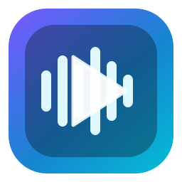

개발 안내: 현재 Claude Code 구독료를 유지하기 어려워 신규 기능 개발은 잠시 중단됩니다.
다만 버그 수정, 최적화, 치명적인 오류 대응 등 필요한 유지보수는 계속 진행됩니다.

# Playlist Canvas

Playlist Creation Studio for Windows

음악, 믹싱, 가사, 비주얼, 애니메이션을 하나의 작업 공간에서.

  
  
  
  

최신 버전 다운로드
·
1.3.1.0 업데이트
·
문제 신고 및 기능 제안

⸻

## Playlist Canvas란?

Playlist Canvas는 플레이리스트를 하나의 콘텐츠로 완성하기 위한 Windows용 제작 스튜디오입니다.

곡을 배치하고, 가사를 맞추고, 앨범 커버와 텍스트를 디자인하고, 음악에 반응하는 효과와 애니메이션을 적용하고, 곡과 곡 사이를 믹싱한 뒤 하나의 MP4 영상으로 완성할 수 있습니다.

Playlist Canvas 하나에서 다음 작업을 이어서 진행할 수 있습니다.

Music → Mix → Lyrics → Visual → Timeline → Preview → Render

프로그래밍 지식이나 별도의 Python 설치는 필요하지 않습니다.

---

단순한 플레이리스트 영상 생성기를 넘어

Playlist Canvas의 목표는 버튼 하나를 눌러 정해진 형태의 영상을 만드는 것이 아닙니다.

플레이리스트 콘텐츠를 제작하는 데 필요한 여러 작업을 하나의 제작 환경에 모으는 것을 목표로 합니다.

음악을 구성하고

원하는 음악을 플레이리스트에 추가하고 순서를 정할 수 있습니다.

곡별로 음량과 5밴드 EQ를 조절하고, MP3 메타데이터와 앨범 커버도 편집할 수 있습니다.

곡과 곡 사이를 연결하고

크로스페이드뿐 아니라 AutoMix를 사용해 곡 사이의 자연스러운 전환을 구성할 수 있습니다.

필요하다면 AutoMix 결과를 직접 열어 파형을 보면서 세밀하게 수정할 수도 있습니다.

화면을 디자인하고

앨범 커버, 제목, 가사, 이미지, 영상, 도형, 로고, 비주얼라이저 등을 캔버스 위에 자유롭게 배치할 수 있습니다.

음악에 움직임을 더하고

텍스트와 가사, 시각 요소에 애니메이션을 적용하거나 음악의 저음과 에너지에 반응하도록 만들 수 있습니다.

하나의 영상으로 완성하고

타임라인과 미리보기에서 결과를 확인한 뒤 최종 결과물을 MP4 영상으로 렌더링할 수 있습니다.

---

## 도움말

Playlist Canvas에는 한국어와 영어 오프라인 도움말이 포함되어 있습니다.

작업 중 F1을 누르면 현재 화면과 관련된 도움말을 열 수 있습니다.

가사 편집기와 AutoMix 편집기의 단축키 안내는 Shift + F1로 확인할 수 있습니다.

문제가 계속된다면 프로그램 버전, 발생 과정, 오류 메시지와 함께 GitHub Issues에 남겨 주세요.

로그 파일은 다음 위치에 저장됩니다.

%LOCALAPPDATA%\PlaylistCanvas\logs

---

만든 영상을 공개하거나 수익화할 수 있나요?

가능합니다.

Playlist Canvas로 만든 영상과 기타 출력물은 개인, 교육, 업무 및 상업적인 콘텐츠 제작에 사용할 수 있습니다.

예를 들면 다음과 같은 이용이 가능합니다.

* YouTube 업로드
* 광고 수익
* 후원 콘텐츠
* 업무용 콘텐츠
* 판매용 영상 제작

단, 영상에 사용한 음악, 이미지, 영상 등의 제3자 저작권은 별도로 확인해야 합니다.

Playlist Canvas 출처 표시는 선택 사항이며, 영상에 워터마크를 넣을 의무도 없습니다.

원한다면 다음 문구를 사용할 수 있습니다.

이 영상은 Playlist Canvas를 이용해 제작되었습니다.
https://github.com/tharu8813/Playlist-Canvas

---

## 라이선스

Playlist Canvas는 일반적인 오픈소스 라이선스가 아니라 Source-Available Noncommercial Share-Alike 방식으로 배포됩니다.

프로그램을 이용해 만든 결과물의 상업적 이용은 허용되지만, Playlist Canvas 프로그램 자체 또는 수정 버전을 상업적으로 판매하거나 유료 접근 형태로 제공하는 것은 허용되지 않습니다.

수정 및 재배포에 대한 정확한 조건은 아래 라이선스를 확인해 주세요.

Playlist Canvas Source-Available Noncommercial Share-Alike License 1.0

FFmpeg와 기타 외부 구성요소에는 각각 별도의 라이선스가 적용됩니다.

---

## 개발 방식

Playlist Canvas는 바이브 코딩(Vibe Coding) 방식으로 개발된 프로젝트입니다.

아이디어 구상부터 기능 설계, 구현, 리팩터링, 테스트와 문서화까지 AI 개발 도구를 적극적으로 활용해 제작되었습니다.

개발 과정에서는 주로 ChatGPT/Codex와 Claude Code를 활용했습니다.

단순한 프로토타입으로 시작했지만 현재는 캔버스 편집, 오디오 분석, AutoMix, 타임라인, 실시간 미리보기, FFmpeg 렌더링과 배포 시스템을 포함하는 데스크톱 제작 도구로 발전했습니다.

---

## 예제

Playlist Canvas로 제작한 예제 영상:

YouTube에서 보기

해당 영상은 Playlist Canvas 1.3.0.0 AutoMix를 기준으로 제작되었습니다.

---

Playlist Canvas

Music. Mix. Visual.

음악을 배치하는 것에서 끝나지 않고,
하나의 플레이리스트를 완성하세요.

 

제작: Ji Beak min (tharu8813)
ChatGPT/Codex와 Claude Code를 활용해 제작했습니다.

