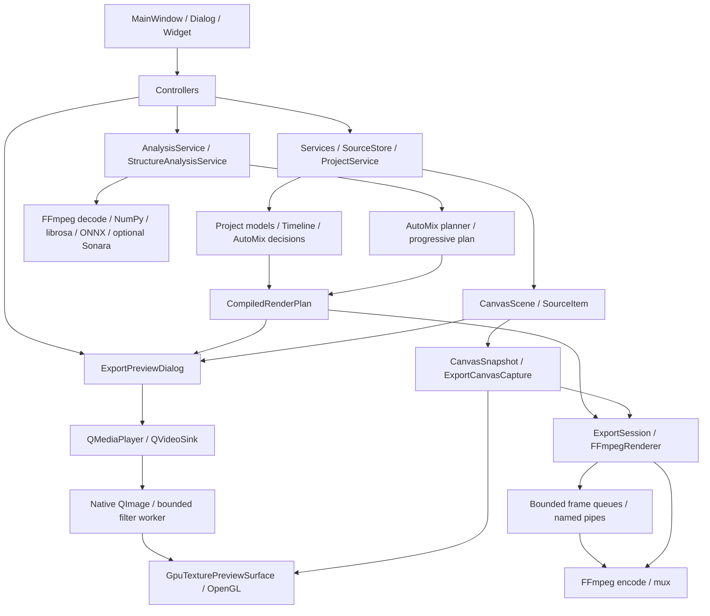

# Playlist Canvas 구조와 실행 경계

2026-10-05 작업 트리 기준. Python 3.12 + PySide6를 유지한다. 기존 graphify 그래프의 연결을 출발점으로 실제 코드를 확인했다. 그래프 탐색 출력 예산은 2,200 tokens였으며 이번 탐색의 실제 API 토큰 비용은 CLI에서 제공되지 않았다. 정적 import에는 `TYPE_CHECKING`과 지연 import도 포함되므로, 양방향 의존성이 모두 실행 시 순환 import라는 뜻은 아니다.

## 전체 실행 흐름

Preview와 AutoMix는 일렬 단계가 아니다. 영상 디코드, 화면 합성, 분석, 오디오 믹스가 서로 다른 스레드/프로세스에서 겹친다. Preview와 Export는 동일한 `CompiledRenderPlan`의 시간 의미를 소비한다.

| 영역 | 모듈 / 소스 줄 수¹ | 주요 책임 | 경계와 주의점 |
|---|---:|---|---|
| `app/canvas` | 22 / 4,443 | 편집 scene, source 배치, Qt item paint | GUI 객체 생성/scene render는 GUI 스레드에 남긴다 |
| `app/preview` | 11 / 4,820 | snapshot, capture, layer 합성, GPU surface, export capture | decoder 생명주기와 이미지 소유권을 보존한다 |
| `app/renderer` | 13 / 5,524 | FFmpeg 명령, pipe, visualizer, 최종 render | Python은 명령과 데이터를 준비하고 codec은 FFmpeg에 맡긴다 |
| `app/automix` | 35 / 8,536 | 분석/cache, beatgrid, 전환 의사 결정, mix render | 분석 결과와 planner를 분리한다 |
| `app/controllers` | 11 / 5,191 | UI 작업 연결, 취소, 진행 상태, preview/export orchestration | UI에서 직접 장시간 작업을 시작하는 경계를 모은다 |
| `app/services` | 30 / 4,407 | 프로젝트/미디어/설정/파일 관리 | serialization과 migration은 안정적으로 유지한다 |
| `app/timeline` | 6 / 1,112 | 시간 모델, compiler, render plan | Qt widget이나 decoder를 참조하지 않는 domain 중심 |
| `app/ui` | 5 / 5,630 | MainWindow와 사용자 이벤트 | 큰 파일은 신규 업무를 controller로 보내며 점진적으로 줄인다 |

¹ 계측 추가 시점의 `.py` 파일 수/물리적 줄 수. `app/dialogs` 등 다른 디렉터리는 포함하지 않는다. 규모 지표이며 실행 비용 지표가 아니다.

## 실제 경로

- 편집: `app/ui/main_window.py` → controller/service → `app/canvas/live_canvas.py:CanvasScene` → `app/canvas/source_item.py:SourceItem` → source별 renderer. 모델이 저장 형식의 기준이다.
- Preview: `app/controllers/preview_controller.py:PreviewController._show_export_preview` → `app/dialogs/export_preview_dialog.py:ExportPreviewDialog.refresh_preview` → 정적 snapshot와 동적 layer → `app/preview/gpu_texture_surface.py:GpuTexturePreviewSurface`. Z 순서에 따라 CPU flatten이 필요한 경우도 있다.
- 영상: `SourceItem._video_frame_changed`는 `QVideoSink` 콜백을 받는다. 지원되는 GPU frame handle/format, 회전/반전 조건이 맞으면 native frame을 전달한다. 그 외는 `QVideoFrame.toImage()`와 `app/video/frame_filter.py`의 worker를 거친다. worker는 현재 작업 하나와 최신 대기 프레임만 유지한다.
- 시간: `app/timeline/compiler.py:compile_playlist/compile_timeline`, `app/automix/planner.py:compile_automix` → `app/timeline/render_plan.py:CompiledRenderPlan`. 일반 playlist와 수동 AutoMix가 동일한 compiler를 무리하게 공유하지 않는다.
- AutoMix: `app/automix/analysis/service.py:AnalysisService`와 `app/automix/structure/service.py` → cache/provider → planner → `app/automix/renderer.py`. 점진 재생은 `app/controllers/progressive_automix_controller.py`와 `app/automix/progressive.py`가 prefix 계획을 관리한다.
- Export: `app/controllers/export_controller.py` / `app/services/playlist_export_service.py` → `app/preview/export_session.py` + `app/preview/export_canvas_capture.py` → `app/renderer/canvas_pipe.py` 또는 staged stream → `app/renderer/ffmpeg_renderer.py` → FFmpeg. live capture와 encoding은 겹치므로 단계 시간을 합산하면 안 된다.

## A / B / C 분류

| 분류 | 코드/업무 | 근거와 방향 |
|---|---|---|
| A: Python 유지 | UI, controller, settings, project/media service, migration | 사용자 이벤트와 IO orchestration이며 매 픽셀 계산이 아니다 |
| A | `timeline/compiler.py`, `render_plan.py`, AutoMix planner/overrides/beatgrid | 테스트 가능한 domain 결정과 dataclass 계약을 유지하는 가치가 크다 |
| A | FFmpeg 명령 생성, 취소/진행 제어, cache key | codec/DSP/ML은 이미 외부 native backend가 실행한다 |
| A | Qt scene/item 소유권, renderer 호출 | Qt의 스레드 제약을 따르는 glue이다. Python 제거 자체로 해결되지 않는다 |
| B: 측정 후 Python 최적화 | `SourceItem._video_frame_changed` cadence, `GpuTexturePreviewSurface._copy_*_video_plane` | 이번 측정에서 손실/복사 비용이 확인되어 수정했다 |
| B | `ExportPreviewDialog.refresh_preview`, `CanvasSnapshot.capture`, source별 paint | dirty region, 불변 layer, Z-band cache를 우선 활용한다. 모든 화면의 flatten을 제거하지 않는다 |
| B | `ExportSession._prepare_bass_envelopes` | 저음 반응 배경의 decode/FFT를 단일 worker에서 준비한다. GUI는 진행 표시와 취소를 처리하고 완성된 envelope를 session에 보관한다 |
| B | `PythonVisualizerRenderer._analyze_rms/_analyze_waveform/_frequency_band_values` | FFT는 NumPy batch로 처리하지만 frame/band별 Python loop가 남는다. 실제 DSP profile부터 확인한다 |
| B | `particle_painter.paint_particles`, animation 상태 계산 | 입자별 Python 수학과 Qt 호출이 반복된다. 개수/scene 구성에 따른 비용 측정이 필요하다 |
| C: 조건부 native 후보 | waveform/RMS/FFT 후처리 또는 입자/animation batch 수치 계산 | B 최적화 후에도 Python self-time이 frame budget을 크게 차지할 때 Rust + PyO3 검토. 이번에는 native 모듈 도입 근거가 부족하다 |
| C 보류 | pixel compositing, frame processing, preview composition | Qt/OpenGL/NumPy를 먼저 사용한다. 새 native 모듈이 GPU readback/업로드를 없애지 못하면 이득이 제한된다 |

## 커질 때 지킬 계약

UI는 입력/화면 갱신, controller는 작업 순서/취소, service는 저장/캐시/미디어 정책, domain은 계획, backend는 DSP/render를 맡는다. 신규 분석이나 파일 IO를 거대한 widget 함수에 추가하지 않는다. 기존 `ExportSession`, `CanvasSnapshot`, `CompiledRenderPlan`을 재사용하며 단일 구현용 interface/factory를 추가하지 않는다.

`canvas ↔ preview`, `preview ↔ renderer`, `renderer ↔ automix`의 정적 연결이 있다. 신규 연결은 `models`/`timeline`의 순수 값 객체를 공유하고, renderer에서 UI widget을 import하는 연결은 만들지 않는다. Qt scene capture를 worker로 통째로 옮기는 대규모 변경은 피한다.

이번 변경은 계측을 `app/utils/performance.py`로 분리하고 기존 호출 경계에 붙였다. 프로젝트 JSON/`.pvsproj` schema, public render-plan 계약, installer/build 설정에는 변경을 추가하지 않았다. 작업 시작 전 존재한 다른 수정은 유지했다.

측정값, 복사 경로, 동시 실행 정책, 검증과 다음 순서는 [performance.md](performance.md)에 있다.
